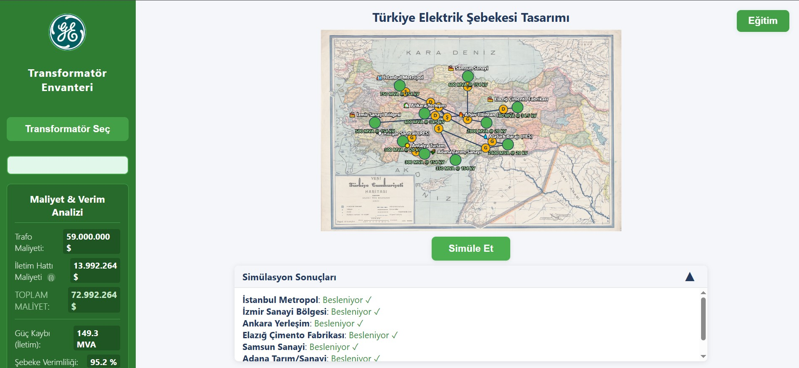
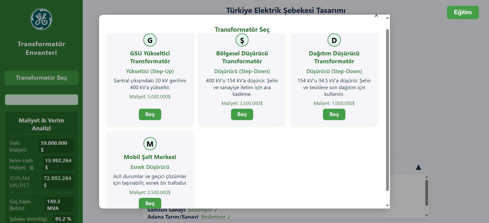

# GE Vernova - Elektrik Şebekesi Simülasyon Uygulaması

Bu proje, GE'deki staj kapsamında geliştirilmiş interaktif bir HTML, CSS ve JavaScript tabanlı bir elektrik şebekesi simülasyon uygulamasıdır.

**Uygulama Arayüzü**

**Trafo Türleri**

## 🧾 Projenin Amacı

Bu uygulama, kullanıcıların farklı türdeki GE Vernova transformatörlerini kullanarak Türkiye ve Dünya haritaları üzerinde elektrik şebekeleri kurmasını sağlar. Kullanıcılar, santrallerden aldıkları elektriği şehirlere ve sanayi tesislerine ulaştırırken maliyet ve verimlilik gibi gerçek dünya mühendislik problemlerini de göz önünde bulundurmalıdır.

## ✨ Özellikler

- **İnteraktif Harita:** Üzerinde işlem yapılabilen, duyarlı harita arayüzü.
- **Çift Harita Modu:** Türkiye ve Dünya haritaları arasında geçiş yapabilme.
- **Gerçekçi Konumlar:** Türkiye ve Dünya'dan gerçek hayattan alınmış enerji santralleri ve talep merkezleri.
- **Detaylı Simülasyon:** Voltaj uyumluluğu, trafo kapasitesi ve paralel bağlantı gibi temel elektriksel prensipleri içerir.
- **Maliyet & Verim Analizi:** Kurulan şebekenin anlık olarak toplam maliyetini, iletim hattı kayıplarını ve genel verimliliğini hesaplayan analiz paneli.
- **Detaylı Maliyet Dökümü:** İletim hattı maliyetlerinin ve verimsizliğin finansal etkisinin incelenebildiği bilgilendirme pencereleri.

## 🛠️ Kullanılan Teknolojiler

- HTML5
- CSS3 (Flexbox ile modern layout)
- JavaScript (ES6+)

## 🚀 Nasıl Çalıştırılır?

Projeyi klonladıktan veya indirdikten sonra, ana klasördeki `index.html` dosyasına herhangi bir modern web tarayıcısı (Google Chrome, Firefox vb.) ile çift tıklamanız yeterlidir.